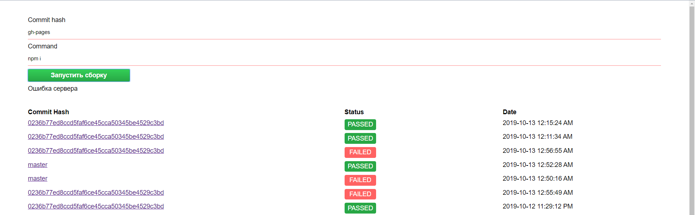

## Простая система Continuous integration

Описание серверной части, которая отвечает за UI и распределение заданий агентам: [Server](/server/README.md)

Описание агента, который отвечает за сборку: [Agent](/agent/README.md)

Для запуска выполните последовательно:
* `npm install`
* `npm run start:server` запуск CI сервера. Конфигурации лежат в [config.server.json](/server/config.server.json) по
 умолчанию запускается на http://localhost:5000
* `npm rub start:agent` запуск и регистрация агента. Конфигурации лежат в [config.agent.json](/agent/config.agent.json) по
умолчанию запускается на http://localhost:3000

Node JS version > 10.0.0

